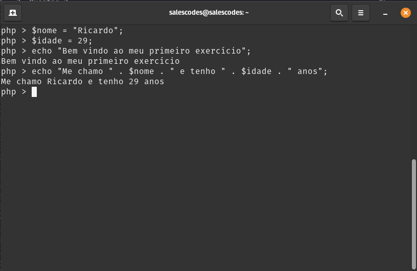

# Exercícios de Fixação

Resolva o exercício utilizando um script.php ou no Shell Interativo, a forma de resolução fica a sua escolha.

1. Crie 2 variáveis para salvar os valores de: **Nome e Idade**.

2. Imprima um texto de apresenção.

3. Imprima seu nome e idade. 

4. Use a concatenação para juntar sua apresentação com as variáveis que você criou.

5. Analise o script abaixo e indique se há algum erro:

~~~php
<?php

$nome = 'Ricardo'
$idade = 26;

echo "Olá me chamo " . $nome . " e tenho " . $idade . " anos.";
~~~

> Atente-se na utilização das quebras de linha.

____

# Respostas

1. Questão 1

~~~php
<?php
$nome = "Ricardo"
$idade = 39;
~~~

2. Questão 2

~~~php
echo "Bem vindo ao meu primeiro exercício";
~~~

3. Questão 3

~~~php
echo $nome . PHP_EOL;
echo $idade . PHP_EOL;
~~~

4. Questão 4

~~~php
echo "Bem vindo ao meu primeiro exercício" . PHP_EOL;
echo "Me chamo " . $nome . " e tenho " . $idade . " anos";
~~~

5. Questão 5

**Resposta:** Na criação da variável nome, não contém a finalização de comando **( ; ponto e vírgula)** o que irá apresentar um erro e o script não funcionará.

### Resultado Final

Para acessar o script desenvolvido na aula: [Clique Aqui](https://github.com/RuanSalles/Material-Didatico-PHP/blob/main/scripts/Exercicio%20de%20Fixacao%2001/exercicio.php)