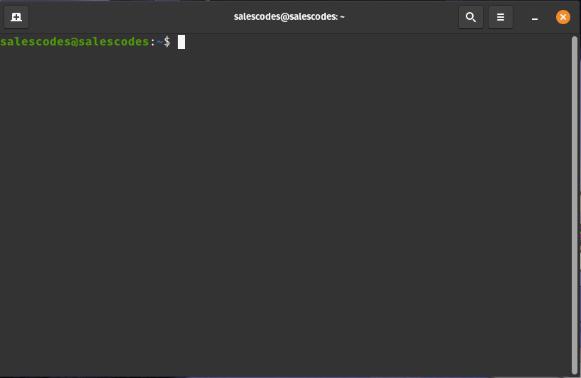
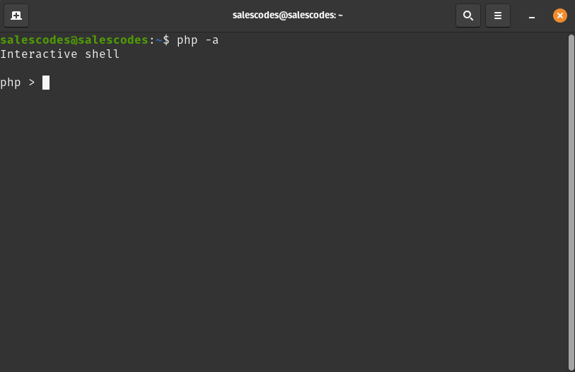
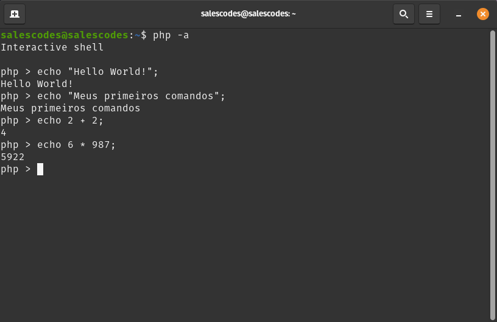
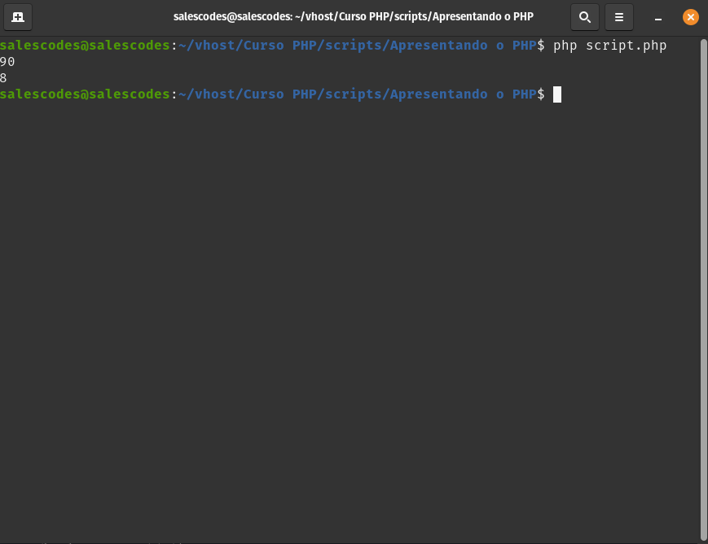

# Interface de linha de comandos

Em toda e qualquer área da informática, seja na programação, seja na manutenção de sistemas operacionais, o termo **CLI (Command Line Interface)** é amplamente conhecido. Visto que antes de haver uma interface visual para que o usuário interaja com o sistema operacional, inicialmente tudo era realizado através do **Console** que nada mais é que um programada que interpreta e roda os comandos de um sistema operacional ou de uma linguagem de programação que contenha um binário executável.

Por exemplo no Linux, ao abrir o terminal e digitar: 

~~~bash
touch meuArquivo.txt
~~~
Você estará criando um arquivo de texto em branco. 

Bem como se digitar: 

~~~bash
echo "Meu texto irá para dentro do arquivo" > arquivo.txt
~~~

Estará criando um **arquivo.txt** com o conteúdo dentro das aspas simples do comando acima.

Sendo assim já deu para notar que são muitas as possibilidades que o CLI entrega ao usuário e quando falamos de programação, se torna algo ainda mais presente e importante o conhecimento.

## CLI no PHP

Assim como foi explicado no texto acima, o PHP contém uma interface de linha de comandos (CLI), onde você poderá realizar testes pequenos, executar comandos, retornar informações sobre o seu PHP entre outras muitas ações.

A partir do momento que seu PHP está devidamente instalado, por padrão o CLI estará ativo e será possível executar dentro de um terminal do seu sistema operacional. Então vamos há uma breve demonstração.

1. Abra um terminal no seu Sistema operacional

2. Logo após digite o comando no seu terminal:

~~~bash
php -a
~~~

A partir deste momento você está dentro do **console** do PHP, isso significa dizer que você poderá executar comandos PHP livremente afim de realizar operações simples.

Vamos executar alguns comandos simples para nos ambientarmos com os retornos e os comandos **PHP**.

Abaixo temos alguns comandos PHP com descrições:

~~~php
/* o comando echo realiza a impressão de um texto simples ou retorna a impressão de algum valor em forma de texto */

// Impressão de texto simples
echo "Hello World!";

echo "Meus primeiros comandos";

// Impressão de uma soma simples
echo 2 + 2;

// Impressão de uma multiplicação simples
echo 6 * 987;
~~~

A seguir temos a tela dos retornos dos comandos dentro do nosso **Shell Interativo do PHP**:

> Não se preocupe caso não entenda em si o que está acontecendo, logo mais você aprenderá todos os comandos e seus significados além de como utiliza-los.

## Executando scripts com CLI

Da mesma maneira que existe a possibilidade de execução dos comandos do PHP diretamente no Shell Interativo (console), o CLI do **PHP** também trás a possibilidade da execução de scripts PHP para interação via console.

Inicialmente é importante entender a estrutura de um script **PHP**, abaixo você encontrará a estrutura básica para um script:

~~~php

<?php //TAG (comando) de abertura de um script PHP

/* 
Comandos Contidos no Script:

echo - Output (impressão de valor em formado textual)
PHP_EOL - Executa uma quebra de linha

*/

/* Divisão simples com PHP */ 
echo 450 / 5 . PHP_EOL; 

/* Potenciação simples com PHP */ 
echo 2 ** 3 . PHP_EOL

//Fechamento do Script PHP
?>
~~~

> Em um Script que contenha apenas PHP não é necessário fechamento da TAG de abertura do PHP. O script irá ser executado sem falhas. Em caso de um script com formado **.php** mas que contenha alguma outra linguagem dentro do script será necessário o fechamento.

Copie e cole o script, salve em um arquivo com o nome que preferir, colocando ao final **.php** como por exemplo: **script.php**, após isso abra um **Terminal** e digite o comando:

~~~bash
php script.php
~~~

Esse será o retorno que será impresso no seu Terminal:

