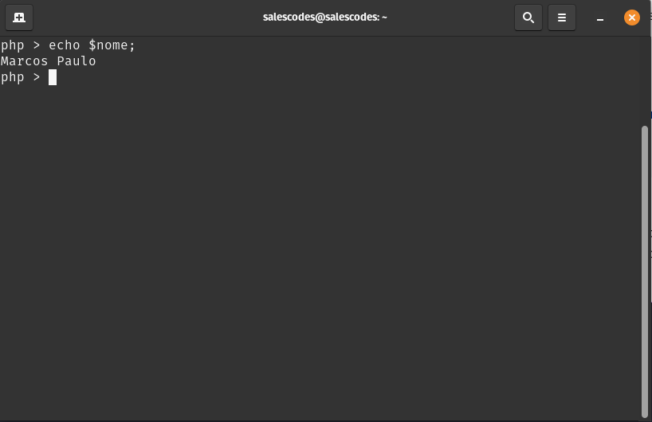
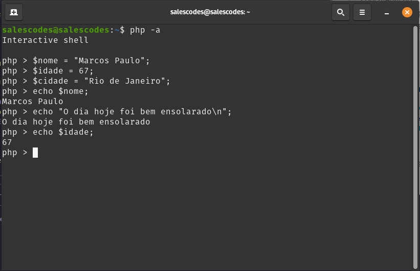

# Primeiros Passos com PHP
 

 Agora que já sabemos utilizar a linha de comandos interativa e executar scripts **PHP** Iremos iniciar de fato algumas ações simples além de dar algumas dicas para melhorar o entendimento e guiar seus estudos.

 
### 1. Criando Variáveis
 

Em toda linguagem de programação existe o conceito de **Variável** que nada mais é que um espaço reservado no seu Sistema Operacional para guardar valores e que de forma dinâmica o seu computador sabe como encontrar esse espaço de memória reservado, a fim de guardar, editar ou resgatar esse valor.
 
>Quando se fala de PHP isso é dinâmico, pois o PHP é considerada uma linguagem de Alto Nível. Uma linguagem de Alto Nível explicada de maneira rápida é que uma linguagem de maior proximidade com a forma de escrita entendida pelo homem.
 
A estrutura de uma variável no PHP é a seguinte:
 
1. Prefixo obrigatório
O **$** é o prefixo obrigatório para criação de uma variável no PHP, ele quem indica que aquele parte do texto é uma variável.
 
 
2. Nome da variável
Após o prefixo obrigatório, você deverá colocar o nome da variável, tente utilizar nomes que façam sentido para facilitar a compreensão.
 
3. Sinal de atribuição
 
O sinal de **= (igual)** tem muitos significados na programação, porém, inicialmente o sinal de **=** após um **$** e algum nome, indica uma atribuição de valor que lê-se "recebe".
 
4. Finalizador de expressões
 
O símbolo **; (ponto e vírgula)** indica a finalização de um comando ou expressão, ele é obrigatório em casos de impressão, atribuição de variáveis, entre outras ações, o importante em saber é que em 98% dos casos é necessário utilizar o **;** como finalização de alguma linha de escrita, poucos são as situações e serão explicadas que não utilizam o símbolo de **;**.
 
Abaixo temos atribuições de variáveis:
 
 

 
~~~php
<?php
 
$nome = "Marcos Paulo";
$idade = 67;
$cidade = "Rio de Janeiro";
 
~~~
 
> Note que variáveis que contenham texto, necessitam que o texto específico fique entre **" " (aspas)**, sejam elas simples ou duplas, contudo existem diferenças na utilização de aspas simples e aspas duplas, porém é conteúdo para outro momento, apenas utiliza aspas, seja ela qual for neste primeiro momento.
 
### 2. Retornando valores de variáveis
 
Como falado anteriormente, variáveis são guardadas em memória e podem ser acessadas através do nome que foi lhe dado, trazendo assim o valor contido nelas. Inicialmente iremos apenas retornar o valor das variáveis em formato de texto simples, com a utilização do comando **echo** sua estrutura é bem simples, como explicado anteriormente:
 
1. O comando
 
Mas digitar **echo**, dê um espaço digite o nome da variável que deseja imprimir e finalize com ponto e vírgula. Ficando assim:
 
~~~php
<?php
 
$nome = "Marcos Paulo";
$idade = 67;
$cidade = "Rio de Janeiro";
 
echo $nome;
 
~~~
 
2. O retorno
 
Executado o script ou digitado no Shell Interativo (CLI) do PHP, o retorno esperado é o seguinte:
 

 
### 2.1 Quebrado Linha
 
É importante que ao retornar um valor seja compreendido seu retorno, há momentos que queremos imprimir mais de um valor, o que é bem comum diga-se de passagem. Então quando precisamos imprimir mais de um valor, para evitar que eles fiquem colados, realizamos quebras de linhas, que são realizadas de 2 (duas) maneiras simples, sendo elas:
 
1. Expressão Universal do Sistema Operacional
 
Uma expressão universal entendida por Sistemas Operacionais é o **\n**, isso mesmo "barra invertida + n", sempre que você quiser quebrar uma linha no seu terminal você pode colocar um **\n** que será realizado.
 
>Obs: O **\n** funciona quando estamos em um conceito de texto, ou seja, uma expressão válida seria: **echo "O dia hoje foi muito ensolarado\n";**
 
2. Constante do PHP
 
Podemos também utilizar uma expressão entregue pelo próprio **PHP** que é o comando **PHP_EOL** Trata-se de um comando que pode ser chamado em qualquer ponto da aplicação e a qualquer momento, desde que seja imprimindo algum valor, seja ele de texto, número ou lógico.
 
> O comando **PHP_EOL** como foi mencionado quebra linha, o comando **echo** retorna o valor de uma variável em formato de texto, porém, para utilizar a constante **PHP_EOL (PHP END OF LINE)**, é necessário realizar a junção do símbolo de **( . )** ponto final, para realizar a "concatenação", por hoje, entenda junção entre os 2 comandos, para impressão + quebra de linha, ficando assim:
 
~~~php
<?php
 
$nome = "Marcos Paulo";
$idade = 67;
$cidade = "Rio de Janeiro";
 
echo $nome . PHP_EOL;
echo "O dia hoje foi bem ensolarado\n";
echo $idade . PHP_EOL;
 
~~~
 
O que trará este resultado:
 
