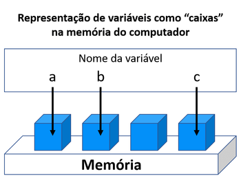

# Variáveis

### O que é uma variável e como funciona?

Variável é o primeiro de muitos conceitos que serão estudados quando se fala de programação. Logo falando-se em PHP não tem como **variáveis** não serem o primeiro tópico a ser estudado. Mas afinal o que é uma variável?

Variável é a forma de guardar dados que as linguagens de programação utilizam, seu funcionamento é simples. A linguagem de programação utilizada, neste caso o PHP, dinâmicamente irá escolher um espaço de memória, para que seja guardado ali um valor específico. Mas como essa mágica funciona?

Quando falamos de linguagens de programação de baixo nível, significa que iremos trabalhar com um tipo de programação mais próximo a linguagem de máquina ou seja, trabalhando com valores binários e hexadecimais ao invés de simplesmente digitar códigos mais parecidos com a linguagem humana.

Aqui está um exemplo de criação de variável com Assembly uma linguagem de programação de baixo nível:

~~~assembly
mov rax, rsi ;rax e rsi são variáveis
add, rbx, 0x1 ;rbx é outra variável
cmp rax, rbx ;Onde você pode armazenar valores
jz , 0xA4     ...
~~~

O valor **0xA4** se refere a localização do espaço de memória no qual se deseja guardar o valor das variáveis e assim por diante. Logo se vê que linguagens de programação de baixo nível são custosas no que se refere a necessidade de um conhecimento de arquitetura de hardware, alocação de memória, tamanho de bits ocupados entre outros pontos muito mais complexos.

Já para o PHP a forma de atribuição é diferente, visto que o PHP é uma linguagem de programação de alto nível, como já foi falado, linguagens de alto nível, são as que tem uma escrita mais próxima do entendimento humano, sendo de fácil leitura e compreensão.

O PHP por sua vez, na hora da tribuição de uma variável, dinâmicamente escolhe um espaço de memória, não sendo necessário **escolher/indicar/apontar** esse espaço de memória que irá guardar os valores, nem tão pouco se preocupar com o tamanho da mesma, ao final, nomeia esse espaço de memória de forma lógica, quase como se colasse uma tarja encima do nome real do espaço de memória, deixando de ser algo como **0xA4B19F3** e se tornando **$nomeCompleto**.

Aqui a baixo vai uma imagem na qual se pode fazer uma analogia, visto que a atribuição de uma variável a nível de sistema, é como se fosse criada uma caixa dentro da memória e essa caixa na sua criação fosse atribuído à ela um endereço, que o PHP fácilmente consegue encontrar pelo nome da mesma e ao acessar endereço podemos recuperar o valor nela guardado.

### Regras para criação de variáveis

Como em toda linguagem de programação, no PHP existe o padrão para criação de variáveis, alguns são opcionais, outros são obrigatórios.

##### Regras de Nomeção de variáveis no PHP
1. Os nomes de variáveis sempre começam com o caractere $ (cifrão).
2. São sensíveis à letras, diferenciando maiúsculo de minusculo
3. São válidos caracteres de a-z e números
4. Uma variável válida, deverá começar com _ ou letra, nunca podendo começar com caracter especial ou número
5. $this é uma palavra reservada, não podendo ser atribuída

##### Estrutura de uma variável

A estrutura básica de uma variável no PHP é a seguinte:

1. Símbolo obrigatório $ (cifrão)
2. Nome válidos
3. Sinal de igual (=) para atribuição de valor
4. Valor
5. Ponto e vírcula ( ; ) finalizando o comando

> O sinal de igualdade ( **=** ) em qualquer linguagem de programação tem a função de atribuir à variável um valor, porém, o sinal de igualdade pode ser utilizado de outras formas, como por exemplo comparação entre valores, mas é um assunto para outro capítulo.

Aqui abaixo está um exemplo de atribuições de variáveis.

~~~php
/* Variáveis válidas */
$nome = "José";
$idade = 29;
$nomeCompleto = "José Antônio";
$_nome = "Maria"
$_complemento = "Casa 89";

/* Variáveis inválidas */

$1dia = "Segunda-feira";
$#escola = "Montes Claros";
$@email = "pessoa@email.com";

/* Variáveis case sensitive */

$nome = "Ricardo";
$Nome = "Olávo";

~~~
> Como salientado anteriormente no último exemplo dos códigos acima, podemos ter 2 variáveis com o mesmo nome, porém, como uma inicia com **N** maíusculo e outra com **n** minusculo, ambas tem valores diferentes e são válidas.
